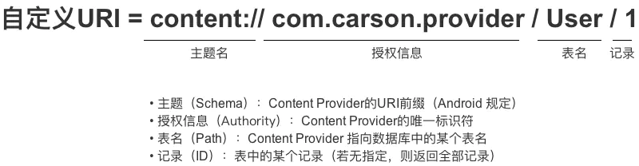

ContentProviderTest
---------------------------

这是一个简单使用ContentProvider进行跨进程（App）数据交互的Demo。

# 简单使用
## ContentProvider 数据提供方
1. 首先**自定义Provider**，实现对应的初始化以及增删改查方法：
```kotlin
class MyContentProvider : ContentProvider() {

    private lateinit var mDBHelper: DBHelper
    private lateinit var mWriteableDatabase: SQLiteDatabase
    private val mMatcher: UriMatcher

    init {
        mMatcher = UriMatcher(UriMatcher.NO_MATCH).apply {
            //若URI资源路径 = content://com.yu.hu.TestProvider/student ，则返回注册码STUDENT_CODE
            addURI(AUTHORITY, STUDENT_PATH, STUDENT_CODE)
            addURI(AUTHORITY, TEACHER_PATH, TEACHER_CODE)
        }
    }

    /**
     * ContentProvider创建后 或 打开系统后其它进程第一次访问该ContentProvider时 由系统进行调用
     * 注：运行在ContentProvider进程的主线程，故不能做耗时操作
     */
    override fun onCreate(): Boolean {
        ...
        return true
    }

    /**
     * 得到数据类型，即返回当前 Url 所代表数据的MIME类型
     */
    override fun getType(uri: Uri): String? = null

    /**
     * 注：
     * 下面增删改查的4个方法由外部进程回调，并运行在ContentProvider进程的Binder线程池中（不是主线程）
     * 所以存在多线程并发访问，需要实现线程同步
     *
     * 若ContentProvider的数据存储方式是使用SQLite & 一个，则不需要，因为SQLite内部实现好了线程同步，若是多个SQLite则需要，
     * 因为SQL对象之间无法进行线程同步
     * 若ContentProvider的数据存储方式是内存，则需要自己实现线程同步
     */
    override fun insert(uri: Uri, values: ContentValues?): Uri {
        val tableName = getTableName(uri)
        mDBHelper.writableDatabase.insert(tableName, null, values)
        //当该URI的ContentProvider数据发生变化时，通知外界（即访问该ContentProvider数据的访问者）
        context?.contentResolver?.notifyChange(uri, null)
        return uri
    }

    override fun delete(uri: Uri, selection: String?, selectionArgs: Array<out String>?): Int {
        val tableName = getTableName(uri)
        return mWriteableDatabase.delete(tableName, selection, selectionArgs)
    }

    override fun update(uri: Uri, values: ContentValues?, selection: String?, selectionArgs: Array<out String>? ): Int {
        val tableName = getTableName(uri)
        return mWriteableDatabase.update(tableName, values, selection, selectionArgs)
    }

    override fun query(uri: Uri,  projection: Array<out String>?, selection: String?, selectionArgs: Array<out String>?,  sortOrder: String? ): Cursor? {
        val tableName = getTableName(uri)
        return mWriteableDatabase.query(tableName, projection, selection, selectionArgs, null, null, ortOrder, null )
    }

    private fun getTableName(uri: Uri): String {
        return when (mMatcher.match(uri)) {
            STUDENT_CODE -> DBHelper.TABLE_STUDENT
            TEACHER_CODE -> DBHelper.TABLE_TEACHER
            else -> throw IllegalArgumentException("unexpected uri:$uri")
        }
    }

    companion object {
        //唯一标识
        const val AUTHORITY = "com.example.MyContentProvider.test"

        const val STUDENT_PATH = "student"
        const val STUDENT_CODE = 1

        const val TEACHER_PATH = "teacher"
        const val TEACHER_CODE = 2

        private const val TAG: String = "MyContentProvider"
    }
}

```
2. **注册**ContentProvider

```xml
<manifest xmlns:android="http://schemas.android.com/apk/res/android"
    package="com.example.contentprovidertest">
    
    
    <!--
       自定义权限
       protectionLevel = normal 表示任何app都可以被授权这个权限，共有4个值可选，
       详见https://developer.android.com/guide/topics/manifest/permission-element?hl=zh-cn

      细分读 & 写权限如下，但本Demo直接采用全权限
     <permission android:name="yu.hu.providertest.Write" android:protectionLevel="normal"/>
     <permission android:name="yu.hu.providertest.PROVIDER" android:protectionLevel="normal"/>
     -->
    <permission android:name="yu.hu.providertest.permission" android:protectionLevel="normal"/>
    
    <application 
                 ....>
    	
        <!-- 
			authorities 唯一标识
			exported设置provider是否可以被其他进程使用

            android:permission="yu.hu.providertest.permission" 设置访问权限，也可通过
            readPermission/writePermission 分开定义读/写权限

            android:grantUriPermissions="true"  授予Intent临时权限？
		 -->
        <provider
            android:authorities="com.example.MyContentProvider.test"
            android:exported="true"
            android:grantUriPermissions="true"
            android:permission="yu.hu.providertest.permission"
            android:name="com.example.contentprovidertest.MyContentProvider">

        </provider>
    
    </application>
    
</manifest>
```

## ContentResolver 数据使用方

1. **请求**相应的**权限**

   ```xml
   <manifest xmlns:android="http://schemas.android.com/apk/res/android"
       package="com.example.contentresolvertest">
       
       <uses-permission android:name="yu.hu.providertest.permission" />
   
       <!--  Android 11 新特性 详见 https://blog.csdn.net/qq_34727886/article/details/110951082  -->
       <queries>
           <provider android:authorities="com.example.MyContentProvider.test" />
       </queries>
       
   </manifest>
   ```

2. 通过ContentResolver执行相应操作

   ```kotlin
   private fun queryStudent() {
       val uri = Uri.Builder().scheme("content")
       .authority(AUTHORITY).path(STUDENT_PATH).build()
       grantUriPermission(AUTHORITY, uri, Intent.FLAG_GRANT_READ_URI_PERMISSION)
       Log.d(TAG, "queryStudent: $uri")
       val cursor = contentResolver.query(uri, null, null, null, null)
       printResult(cursor)
   }
   
   private fun printResult(cursor: Cursor?) {
       cursor?.apply {
           val result = buildString {
               while (moveToNext()) {
                   append("[${getInt(0)},${getString(1)}] ")
               }
           }
           Toast.makeText(this@MainActivity, result, Toast.LENGTH_SHORT).show()
           Log.d(TAG, "queryStudents:$result")
           close()
       }
   }
   ```

## ContentObserver

## 相关工具类
## ContentUris

用于操作URI，核心方法有两个：`withAppendedId（）` &`parseId（）`

```java
// withAppendedId（）作用：向URI追加一个id
Uri uri = Uri.parse("content://cn.scu.myprovider/user") 
Uri resultUri = ContentUris.withAppendedId(uri, 7);  
// 最终生成后的Uri为：content://cn.scu.myprovider/user/7

// parseId（）作用：从URI中获取ID
Uri uri = Uri.parse("content://cn.scu.myprovider/user/7") 
long personid = ContentUris.parseId(uri); 
//获取的结果为:7
```

## UriMatcher

用于在ContentProvider中注册URI，并根据URI匹配ContentProvider中对应的表：

```java
// 步骤1：初始化UriMatcher对象
UriMatcher matcher = new UriMatcher(UriMatcher.NO_MATCH); 
//常量UriMatcher.NO_MATCH  = 不匹配任何路径的返回码
// 即初始化时不匹配任何东西

// 步骤2：在ContentProvider 中注册URI（addURI（））
int URI_CODE_a = 1；
    int URI_CODE_b = 2；
    matcher.addURI("cn.scu.myprovider", "user1", URI_CODE_a); 
matcher.addURI("cn.scu.myprovider", "user2", URI_CODE_b); 
// 若URI资源路径 = content://cn.scu.myprovider/user1 ，则返回注册码URI_CODE_a
// 若URI资源路径 = content://cn.scu.myprovider/user2 ，则返回注册码URI_CODE_b

// 步骤3：根据URI 匹配 URI_CODE，从而匹配ContentProvider中相应的资源（match（））

@Override   
public String getType(Uri uri) {   
    Uri uri = Uri.parse(" content://cn.scu.myprovider/user1");   

    switch(matcher.match(uri)){   
            // 根据URI匹配的返回码是URI_CODE_a
            // 即matcher.match(uri) == URI_CODE_a
        case URI_CODE_a:   
            return tableNameUser1;   
            // 如果根据URI匹配的返回码是URI_CODE_a，则返回ContentProvider中的名为tableNameUser1的表
        case URI_CODE_b:   
            return tableNameUser2;
            // 如果根据URI匹配的返回码是URI_CODE_b，则返回ContentProvider中的名为tableNameUser2的表
    }   
}
```


## 其他相关知识点

## URI

统一资源定位符（Uniform Resource Identifier）。下面借用参考文章中的一张图：



生成Uri可以使用**Uri.Builder**生成：

```kotlin
val uri = Uri.Builder().scheme("content").authority(AUTHORITY).path(TEACHER_PATH).build()
```

## MIME

在这里用于指定某个扩展名的文件用某种应用程序来打开。如指定`.html`文件采用`text`应用程序打开、指定`.pdf`文件采用`flash`应用程序打开。

# 参考文章

* [Android：关于ContentProvider的知识都在这里了！](https://www.jianshu.com/p/ea8bc4aaf057)
* [\<permission\> | Android Developers](https://developer.android.com/guide/topics/manifest/permission-element?hl=zh-cn)
* [Failed to find provider info for com.example.databasetest.provider，Unknown URL content:...等问题简单解决方法](https://blog.csdn.net/qq_34727886/article/details/110951082#commentBox)
