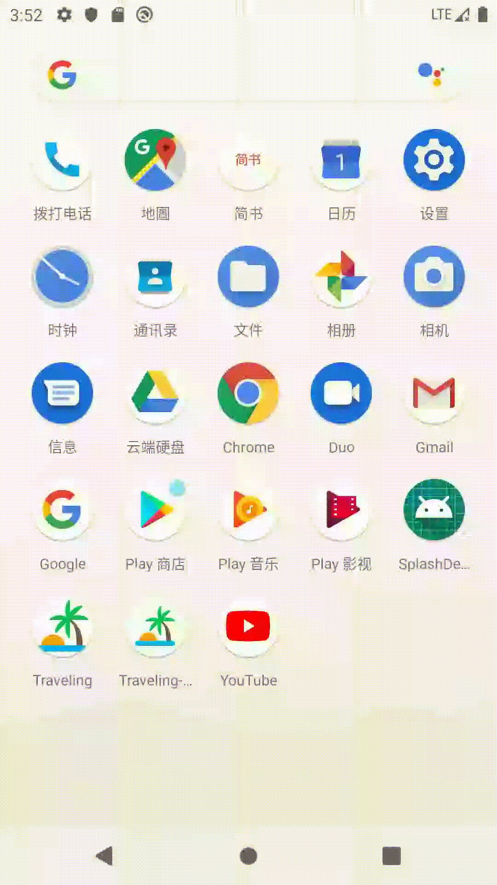
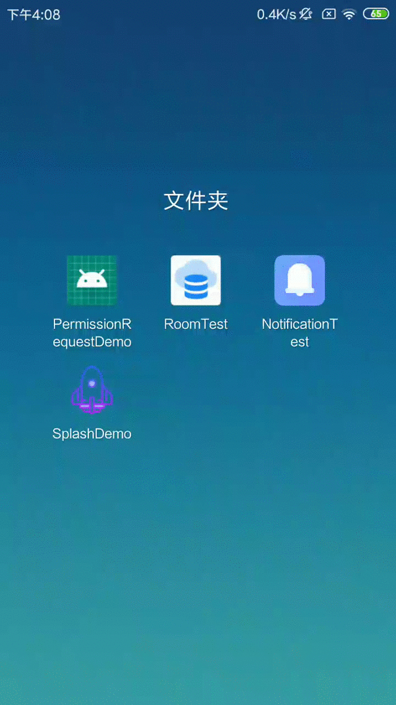
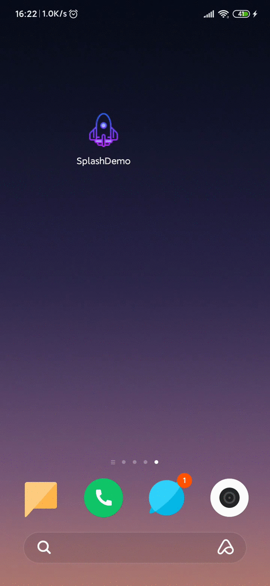
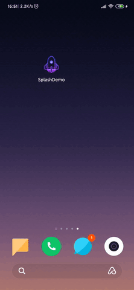
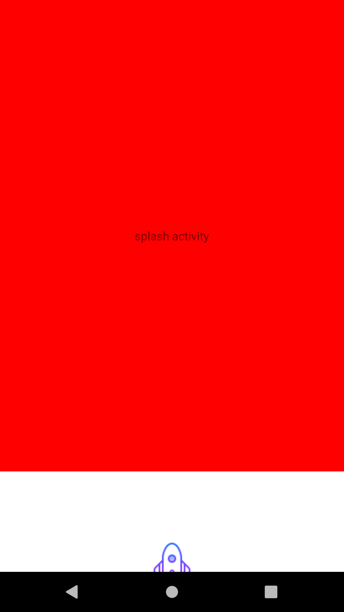
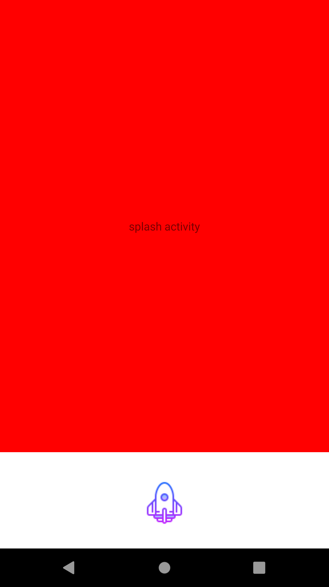

# Android启动页实现（启动优化，刘海屏水滴屏全屏适配等）

**最终效果图**：<br/>


直接下载[apk](apk/SplashDemo.apk)

## 前言
最近想实现一个启动页，于是试了手机里的几个常用`App`，总结出以下需要**实现**的**要点**或**注意点**：
1. **启动优化** <br/>
 一般情况下，**冷启动**时在`Application`初始化的过程中会出现**短暂的白屏或黑屏**，这里可以做一个优化，提高用户体验。
2. **固定屏幕方向**<br/>
经测试，大多数的应用（宇宙条除外），其启动页都是*仅支持竖屏展示*的，如果横屏展示的图片会被拉伸，影响美观。
3. **开屏广告** —— **异形屏全屏适配**（刘海屏，水滴屏等）<br/>
 通常启动页都会有一个开屏页广告，**需要占据通知栏**的，一般情况下只需要设置一个全屏主题即可解决，但是当碰到异形屏（如 水滴屏，刘海屏等）时就需要做一些**额外的适配**工作。
4. 虚拟的**导航栏遮盖**问题<br/>
如果存在**虚拟`NavigationBar`**，那么还需要做一个**适配**，否则**默认情况下**，**启动页的底部**如果有文字或图片的话**会被虚拟的导航栏遮盖住**。
5. **屏蔽Back键** <br/>
即展示启动页时`back`无效，但是可以按`home`键返回桌面。

<br/>
ok，明白了需求，下面开始实际操作：

## 基本实现
首先我们**先来实现一个基础版本**，然后**再一点一点的进行优化**。
由于最近在学习[架构组件](https://developer.android.google.cn/topic/libraries/architecture)，所以`Demo`是基于`MVVM`实现的，不过对于本文的内容并没有什么影响。<br/>
1. 自定义定义全屏主题 **`AppTheme.Splash`** ：
```xml
<!--全屏主题-->
<style name="AppTheme.Splash" parent="Theme.AppCompat.Light.NoActionBar">
    <item name="windowNoTitle">true</item>
    <item name="windowActionBar">false</item>
    <item name="android:windowFullscreen">true</item>
    <item name="android:windowContentOverlay">@null</item>
    <!-- 设置window过度效果 禁用窗口的预览动画 -->
    <item name="android:windowDisablePreview">false</item>
</style>
```
2. 定义我们的启动页 **`SplashActivity`** 并在`AndroidManifest.xml`中**设置上自定义的全屏主题**：
```java
public class SplashActivity extends AppCompatActivity {

    @Override
    protected void onCreate(@Nullable Bundle savedInstanceState) {
        super.onCreate(savedInstanceState);
        ActivitySplashBinding mBinding =
                DataBindingUtil.setContentView(this, R.layout.activity_splash);

        //2s延迟后进入MainActivity
        new Handler(Looper.getMainLooper()).postDelayed(new Runnable() {
            @Override
            public void run() {
                Intent intent = new Intent(SplashActivity.this, MainActivity.class);
                intent.addFlags(Intent.FLAG_ACTIVITY_NEW_TASK);
                startActivity(intent);
                finish();
            }
        }, 2000);
    }
}
```
```xml
<activity 
    android:theme="@style/AppTheme.Splash"
    android:name=".splash.SplashActivity">
    <intent-filter>
        <action android:name="android.intent.action.MAIN" />

        <category android:name="android.intent.category.LAUNCHER" />
    </intent-filter>
</activity>
```

3. `layout`文件就不上了，通过效果图就能看出来，就只是放了一张图片。

效果图（`Pixel`）：<br/>


可以看到有**很明显的白屏**。

## 启动优化
这里的启动优化，其实是**给启动时的白屏添加一个背景**，这样用户在使用时是无感知的，从来造成一种启动很快的错觉。
1. **`drawable`** 文件夹下面制作背景图片`layer_launcher.xml`：
```xml
<?xml version="1.0" encoding="utf-8"?>
<layer-list xmlns:android="http://schemas.android.com/apk/res/android">

    <item>
        <shape android:shape="rectangle">
            <solid android:color="#FFF" />
        </shape>
    </item>

    <item android:bottom="25dp">
        <bitmap
            android:gravity="bottom|center_horizontal"
            android:src="@drawable/ic_launcher" />
    </item>
</layer-list>
```

2. 在全屏主题`AppTheme.Splash`设置上我们自定义的背景：
```xml
<style name="AppTheme.Splash" parent="Theme.AppCompat.Light.NoActionBar">
    ...
    <!-- 设置window背景 -->
    <item name="android:windowBackground">@drawable/layer_launcher</item>
</style>
```

3. 设置了`window`的背景之后，启动页就可以不设置图片了：
```xml
<?xml version="1.0" encoding="utf-8"?>
<layout xmlns:android="http://schemas.android.com/apk/res/android">

    <data>

    </data>

    <LinearLayout
        android:layout_width="match_parent"
        android:layout_height="match_parent"
        android:orientation="vertical">
           
        <TextView
            android:gravity="center"
            android:text="splash activity"
            android:background="#F00"
            android:layout_marginBottom="120dp"
            android:layout_gravity="center_horizontal"
            android:layout_width="match_parent"
            android:layout_height="match_parent"/>

        <!-- <View-->
        <!--    android:layout_width="match_parent"-->
        <!--    android:layout_height="0dp"-->
        <!--    android:layout_weight="1" />-->
        
        <!-- <ImageView-->
        <!--    android:layout_width="80dp"-->
        <!--    android:layout_height="80dp"-->
        <!--    android:layout_gravity="center_horizontal|bottom"-->
        <!--    android:layout_marginBottom="30dp"-->
        <!--    android:scaleType="fitXY"-->
        <!--    android:src="@drawable/ic_launcher" />-->

    </LinearLayout>
</layout>
```
效果图（RedMi 3S）:<br/>


ok，可以看到，设置了背景之后感觉好多了，只不过这里为了更好的辨别添加了一个大红色的`TextView`可能看起来还是比较突兀。 = = <br/>

**ps**:<br/>
如果你的**背景图片被拉伸变形了**，可以尝试把图片资源转移到 **`drawable-xxhdpi`** 文件下。

## 固定屏幕方向 —— 强制竖屏
这个简单，其实就是在`AndroidManifest.xml`中给`SplashActivity`设置`screenOrientation`属性为 **`portrait`** 即可。
```xml
<activity
    android:name=".splash.SplashActivity"
    android:screenOrientation="portrait"
    android:theme="@style/AppTheme.Splash">
    <intent-filter>
        <action android:name="android.intent.action.MAIN" />

        <category android:name="android.intent.category.LAUNCHER" />
    </intent-filter>
</activity>
```

## 异形屏全屏适配
首先我们先来看看当前所实现的代码在**水滴屏上的效果**（XiaoMi CC9e）：<br/>

<br/>
可以看到，屏幕上方有一个小黑条，所以对于异型屏，我们需要进行**额外的适配**，这些**适配可以分为两种**：
* **Android P**(9.0)及以上的手机，**`Google`官方给我们提供了[解决方案](https://developer.android.com/guide/topics/display-cutout?hl=zh-CN)**。
* **Android O**(8.0)及以下的手机，由于这时没有官方的适配方案，所以**只能根据具体的机型去查看相应厂商给我们提供的解决文档**了。

### Android P 适配
根据[文档]()，我们只需要在全屏主题中再添加一个`windowLayoutInDisplayCutoutMode`属性并且值为 **`shortEdges`** 即可，只不过由于是**Android P**才出的，所以需要复制一份主题到`values-v28/styles.xml`中并设置上该属性：
```xml
<!-- values-v28/styles.xml -->
<?xml version="1.0" encoding="utf-8"?>
<resources>
    
    ...
    
    <style name="AppTheme.Splash" parent="Theme.AppCompat.Light.NoActionBar">
       
       ...
       
       <!-- Android P 异性屏适配 可以达到全面屏的效果 -->
       <item name="android:windowLayoutInDisplayCutoutMode">shortEdges</item>
    </style>
</resources>
```

### Android O 适配
很遗憾，设备资源有限，手上的真机只有一部**红米3S**和**小米CC9e**（水滴屏 Android Q），完美的避开了这种情况。 = =<br/>
不过我有在某个博客中（原谅我找不到了原博客链接了）看到了解决方案（**未验证**），需要的小伙伴的可以顺便验证一下：
```xml
<activity
    android:name=".splash.SplashActivity"
    android:screenOrientation="portrait"
    android:theme="@style/AppTheme.Splash">
    <intent-filter>
        <action android:name="android.intent.action.MAIN" />

        <category android:name="android.intent.category.LAUNCHER" />
    </intent-filter>

    <!--允许绘制到oppo、vivo刘海屏机型的刘海区域 -->
    <meta-data
        android:name="android.max_aspect"
        android:value="2.2" />

    <!-- 允许绘制到华为刘海屏机型的刘海区域 -->
    <meta-data
        android:name="android.notch_support"
        android:value="true" />

    <!-- 允许绘制到小米刘海屏机型的刘海区域 -->
    <meta-data
        android:name="notch.config"
        android:value="portrait" />
</activity>
```
### 全屏适配
**你以为这样就真的OK了吗**？ **too young too simple !**，先来**上面的方案执行后的效果**(XiaoMi CC9e)：<br/>
<br/>
之前的**小黑条**变成**白条**了,说明我们前面做的适配是生效了的，但是我们的`TextView`并没有**延伸要屏幕顶部**，下面是解决方案：<br/>
在全屏主题中添加以下两个属性即可，注意这两条属性是**API 21**出来的，所以需要**新建`values-v21/styles.xml`**，别忘了之前添加的`values-v28/styles.xml`中也要加上：
```xml
<!-- values-v21/styles.xml -->
<?xml version="1.0" encoding="utf-8"?>
<resources>
    
    ...

    <style name="AppTheme.Splash" parent="Theme.AppCompat.Light.NoActionBar">
            
        ...
        
        <!-- 设置statusBarColor 为透明-->
        <item name="android:windowTranslucentStatus">true</item>
        <item name="android:statusBarColor">@android:color/transparent</item>
    
    </style>
</resources>
```
效果图（XiaoMi CC9e）：<br/>


## 被虚拟`NavigationBar`遮挡问题
先来看一下当前代码在`Pixel`上的运行情况:<br/>

<br/>
可以看到我们的`logo`被虚拟的导航栏遮盖住了，这时候需要在**全屏主题中添加以下属性**:
```xml
<style name="AppTheme.Splash" parent="Theme.AppCompat.Light.NoActionBar">
     
     ...
     
    <!-- 在5.0后，增加了一个windowDrawsSystemBarBackgrounds属性，用来标志此窗口是否负责绘制系统栏背景，
    我们把它设成false，这样当它绘制windowBackground的时候，就会在NavigationBar之上。-->
    <item name="android:windowDrawsSystemBarBackgrounds">false</item>
</style>
```
同样的，需要在 **`values-v21`** 和 **`values-v28`** 下的`styles.xml`中**都加上**。<br/>
效果图（pixel):<br/>

<br/>
## 屏蔽Back键
重写`SplashActivity`的 **`onBackPressed`** 方法什么都不做即可：
```java 
public class SplashActivity extends AppCompatActivity {

    ...

    @Override
    public void onBackPressed() {
        //屏蔽back键
    }
}
```

## 最后

[Demo链接](https://github.com/12313kaihuang/Demos/edit/master/SplashDemo)<br/>

原来一个启动页就有这么多的东西在里面。。<br/>
Demo中肯定还有没有适配到的地方，如果发现文中哪里有错或不足欢迎指正~。

## 参考文章
* [Splash适配解决启动图拉伸的问题](https://blog.csdn.net/aa464971/article/details/86692198)
* [Android刘海屏、水滴屏全面屏适配方案](https://juejin.im/post/5cf635846fb9a07f0c466ea7)
* [Support display cutouts](https://developer.android.com/guide/topics/display-cutout?hl=zh-CN)
* [Android关于沉浸式状态栏总结](https://juejin.im/post/5989ded56fb9a03c3b6c8bde)
* [Android 全面屏启动页适配的一些坑](https://www.itcodemonkey.com/article/10151.html)
